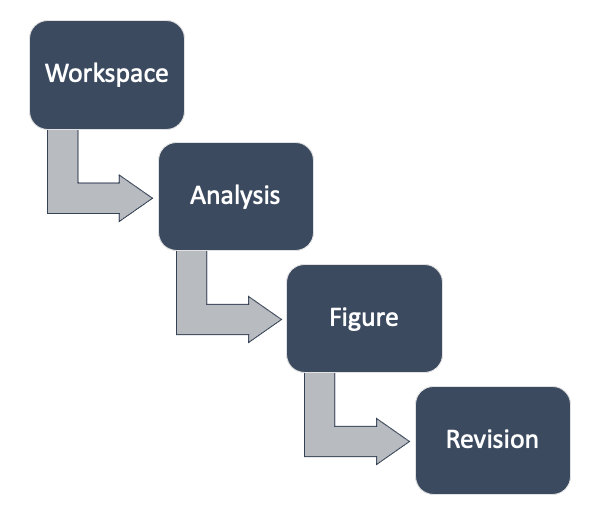

Organizing your analyses
========================

GoFigr organizes data hierarchically:

Workspace:
   A workspace is the place for a team to collaborate. A workspace can contain multiple analyses, which are
   automatically viewable by other members of the team. Billing also happens per-workspace.

Analysis:
   An analysis contains multiple related figures. These will usually correspond to a single Jupyter notebook.

Figure:
   A figure represents a single visualization, and can contain one or more revisions.

Revision:
   A single version of a figure. Contains image data in multiple formats, metadata (arbitrary JSON), and, optionally,
   dataframes used to generate the figure.

Primary workspaces
*******************
Each user has a primary workspace created at account registration. This workspace is permanently
tied to your account. While this workspace can be shared with others, for collaboration we recommend creating
a separate workspace. That way you can transfer ownership later if you need to.

Best practices
***************

1. In the web app (https://app.gofigr.io), create a workspace for your team/organization and add your teammates.

2. Create a separate analysis for each notebook. The library can do this for
you automatically (see :ref:`jupyter_setup`)

3. A figure should correspond to a single ``plt.figure()``

Notebook configuration
-----------------------

Load and configure the extension at the top of your notebook. Please customize
as needed (see :func:`gofigr.jupyter.configure`):

.. code:: python

    %load_ext gofigr

    from gofigr.jupyter import *

    configure(auto_publish=True,
              workspace=FindByName("Boilerplate Co", create=False),
              analysis=FindByName("Clinical Trial #1", create=True),
              default_metadata={'requested_by': "Alyssa",
                                'study': 'Pivotal Trial 1'},
              annotators=DEFAULT_ANNOTATORS)

Auto-publish
--------------

When you use auto-publish functionality, GoFigr will automatically create a unique figure for each unique matplotlib
figure within Jupyter cell, using the following naming convention: ``Cell <cell ID>, Figure <figure number>``.

Please note that certain versions of Jupyter Notebook do not provide cell IDs to extensions. In that case, your figures
will be named ``Cell Unknown, Figure <figure number>``.

All figures are published under the analysis specified during the call to :func:`gofigr.jupyter.configure`.

To keep things tidy and organized your way, we recommend calling ``publish`` for each figure and specifying
the appropriate GoFigr target figure:

.. code:: python

    publish(fig=plt.gcf(), target=FindByName("My first figure!", create=True))

Figures published this way will only be published once even with auto-publish turned on.
